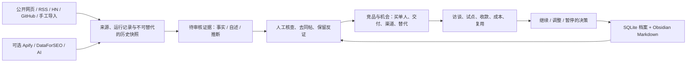

# MarketIntel · 个人市场情报与决策工作台

为会用 AI 辅助开发、探索海外英文市场的个人创业者建立长期研究档案。系统把公开线索、反证、竞品、机会、实际验证和决策串起来，用历史证据辅助选择下一步。

这是可运行的本地应用。公开讨论不是已验证需求，竞品标价不是你的成交价，情景计算不是成功率。系统没有凭空生成收入、流量、市场规模或“成功概率”的功能。

## 启动与日常使用

双击 `start.command`，保持出现的终端窗口运行，然后打开 [http://127.0.0.1:8765](http://127.0.0.1:8765)。首次运行会建立空数据库与知识库。启动脚本使用本机 Python，无需第三方运行包。macOS / Linux 可运行 start.command，Windows 可使用 start.bat。

也可在项目目录使用 Python 3.9 或更新版本：

```sh
python3 app.py
```

端口占用时使用 `python3 app.py --port 8766`。数据目录可通过 `--data-root /绝对路径` 指定；界面代码始终从程序目录加载。服务仅监听本机 `127.0.0.1`，不应直接作为公网服务部署。

在 Obsidian 选择“打开文件夹作为知识库”，打开数据根目录下的 `vault` 文件夹；工作台会显示实际目录。Obsidian 不是启动应用的依赖。

默认不会导入他人的研究资料。需要查看历史示例时，显式运行 `python3 app.py --demo`；演示标有历史日期，采集与追踪默认关闭。已有数据库会保留原资料。

## 已实现的工作流程

1. **先查历史**：搜索具体任务、竞品或曾经否决的理由，调用原有结论和人工笔记。
2. **限定研究方向**：描述买单人、具体任务、英文检索词和地区。优先选择你能接触客户、能人工交付的任务。
3. **收集线索**：用 Hacker News / Algolia 或 GitHub Issues 搜索；也可导入 CSV / JSON、手工录入公开讨论。自动搜索一次最多取 30 条结果，并在取新结果前记录历史检索命中。
4. **审核证据**：打开原始 URL，核对原文、角色、时间、推广意图、同一讨论分组和问题是否已经解决。将支持、反证、中性陈述与事实、自述、推断分别记录。导入和模型生成不会自动变成已审核证据。
5. **追踪竞品**：比较原生功能、免费表格、人工服务及直接软件竞品。保存价格币种、计费周期、来源和核查日期；添加公开价格页或 RSS 作为追踪来源。
6. **形成机会**：定义具体交付、已有替代、获客入口和差异假设，关联同一方向的证据。评估展示已审核证据、来源分组、反证、付款与复用记录，以及缺失条件。
7. **做真实验证**：在机会中记录访谈或交付结果，实际付款、日期、币种、成本、再次购买/使用情况。没有实际收款记录，不能把机会升为“已有成交”；进入“重复使用”还必须有复用记录。若更正最后一笔收款会导致阶段失去依据，需先将机会改回验证阶段。
8. **记录决策**：选择继续、调整或暂停，写明理由、重启条件和下一步。导出报告或创建备份，下一轮从这些记录开始。

### 收集到的内容如何成为可信资料

网页采集只产生**快照**；需要在“快照”窗口点击“生成待审核证据”，提取可核查的具体陈述。不要把整页内容自动认定为痛点。搜索结果统一待审核；审核代表你完成核查，不代表系统证明了自述真实。

来源分组按填写的讨论分组、URL 或记录 ID 去重，**不代表独立用户数**。同一人多平台发帖仍需要人工识别。已审核反证计数与待审核反证分开；已排除证据不进入评估。

### 优先推进什么方向

比较的是“证据与验证是否足够”，没有人为设定权重的成功率排行榜：

| 层次 | 系统需要的材料 | 适合下一步 |
|---|---|---|
| 只有社区抱怨 | 可定位原文、角色和已解决情况 | 查反证、访谈，暂不开发完整产品 |
| 已核查重复任务 | 买单人、替代方案、频率与损失 | 提供一次明确交付，询问真实付款 |
| 有实际付款 | 收款、实际交付成本、获客方式 | 复做相同任务，确认可重复交付 |
| 有复用及可接受成本 | 再次购买/使用及完整成本口径 | 再考虑自动化、模板、工具站或订阅 |

可选历史示例中的三个方向：建站资料就绪、供应商 CSV 整理、烘焙报价都只是**待补证候选**。没有经过同口径的付款和成本验证，不能判断哪个最赚钱。已有免费或成熟替代是需要面对的反证。先做可收费的人工交付，可以更快得到系统目前缺失的数据。

## 框架与原理



数据库是结构化档案的主存储，知识库保存可阅读笔记、历史报告和人工判断。每条记录使用稳定 ID；笔记包含来源链接与关联档案。网页正文用 SHA-256 对比：内容一致复用原快照，内容变化保留前后两份及文本差异，不覆盖历史。

利润模块只计算你输入的假设：月经营结余 = 客户数 ×（单客户月收入 − 单客户月变动成本）− 月固定成本 − 月获客支出。任一项未填时显示“未知”；零与未知分开。假设必须使用同一币种、同一月份口径，税费和个人劳动成本是否包含由你注明。实际验证的收款减交付成本按币种分别汇总，不自动换汇，也不等于完整净利润。

## 环境依赖与目录

| 组件 | 依赖 / 位置 |
|---|---|
| 后端、数据库、调度 | Python ≥ 3.9 标准库：HTTP、SQLite、线程、文件系统 |
| 工作台 | 现代浏览器，原生 JavaScript / CSS；无需 Node 构建 |
| 人工知识库 | 可选 Obsidian；Markdown 不依赖插件 |
| 搜索与采集 | 公网访问；无需密钥的来源仍可能限流或不可达 |
| 付费与模型连接 | 可选供应商账号和密钥；没有配置时不调用 |

```text
app.py                   启动入口；默认空库，--demo 载入示例
marketintel/settings.py   本机连接凭据、状态与脱敏
marketintel/core.py       数据验证、历史、决策评估、笔记、备份
marketintel/collectors.py  公开文本 / RSS 采集、Apify、调度
marketintel/research.py    线索搜索、关键词数据、模型摘要
marketintel/server.py      本机 API 与静态页面
web/                      工作台界面与样式
tests/                    标准库自动化测试
config/connections.json   用户填写的本机凭据（不提交、不备份）
data/intelligence.sqlite  主数据库
data/raw/                 原始响应（来源可关闭保存）
vault/                    可独立打开的 Obsidian 知识库
backups/                  数据库 + 知识库 + 原始文件的一致性备份
docs/                     API、来源与验收记录
```

## Obsidian 与长期沉淀

笔记按方向、来源、竞品、证据、研究、验证、机会和决策分目录。系统只更新 `<!-- MARKETINTEL:BEGIN -->` 到 `<!-- MARKETINTEL:END -->` 之间的生成区域及 id/type/title/updated/project_id 属性。请把人工判断写在该区域外；自定义属性会保留。

可以重命名笔记，系统会按 frontmatter 中的稳定 ID 找回。修改生成区域中的数据不会反向改数据库；请在工作台编辑结构化记录。人工 Markdown 会被检索读取，但不会自动提升证据状态或改变决策。

删除生成标记后同步会产生“待合并.md”，保留原笔记。不要删除或更改稳定 ID。笔记中自定义的项目属性应使用系统相同的 `project_id`，才能进入该方向的过滤检索；未关联的人工笔记可在“全部方向”搜索。

一轮研究结束，保存一条决策：观察了什么、反证是什么、采取什么行动、如何验收、什么变化值得重新考虑。这样知识库积累的是可复用判断，而不只是网页收藏。

## 自动追踪与费用控制

在来源设置勾选自动复查，设置小时数。程序每分钟查看到期来源，每个来源失败后至少间隔一小时再重试，同时最多运行两个采集任务。首版只有公开网页 / RSS 自动复查；收费 Actor 必须手动运行。演示来源默认关闭采集许可与自动复查。

电脑休眠或程序停止时不会执行；恢复后重新计算到期来源。尚未提供云端常驻、邮件、推送、自动发帖或自动购买。变化在工作台显示，由你审核；页面导航或广告变化可能造成噪声。

公开网页采集是文本方式，不执行 JavaScript、不登录、不绕过限制。每次最多 2 MB；只读取 80/443 端口，拒绝私网地址，重定向逐次检查。动态页面可用允许的导出、手工摘要或适当的 Actor。Painbase、TrustMRR、Reddit 默认不自动采集；它们可作为研究入口或许可允许的手工资料来源。

### 可选连接

在“数据与连接 → 使用你自己的 API Key”填写并保存，配置立即对后续请求生效，留空保留原值；可按连接清除。密钥不回显，不写入浏览器 localStorage，不进入研究导出、笔记或备份。配置是本机明文文件，POSIX 文件权限为 0600；不要在 Actor 输入、来源 URL 或研究笔记中填写密钥。

也支持将 `.env.example` 复制为数据根目录下的 `.env` 后填写并重启。配置优先级是：界面保存的字段（含显式清空）> 环境变量 > 数据根目录 `.env`。界面清除会屏蔽旧环境值，外部环境或 `.env` 原值需自行删除。详见 `SECURITY.md`。

| 连接 | 配置 | 已实现范围与限制 |
|---|---|---|
| Apify | `APIFY_TOKEN` | Actor ID 为 owner/name，填写 Actor 输入 JSON；来源设置中手动允许运行。单次费用上限 >0 且 ≤20 美元，运行设置 180 秒超时，最多读取 200 条输出。具体输入和允许用途以 Actor 说明为准。保存 run ID，可恢复同一个远端任务。 |
| DataForSEO | `DATAFORSEO_LOGIN`、`DATAFORSEO_PASSWORD` | Google Ads 美国、英文口径，每次 1—20 个词。保存原始指标、核查时间和返回费用。广告竞争不等于 SEO 难度。每次手动操作可能产生费用，没有设定虚构预算。 |
| AI / OpenRouter | `OPENROUTER_API_KEY`、`OPENROUTER_MODEL` | 指定你可访问的模型。发送选定方向最多 40 条证据摘要、最多 5 条历史摘录和最近 5 条决策，输出 token 上限 1800。保存模型、用量、证据 ID，标为模型推断待审核。 |

未使用你的付费账号做真实调用。这些适配器经过模拟接口测试，需要连接真实账号后检验对应 Actor、模型和额度。Apify 启动请求若断网且未取得 run ID，程序禁止把“恢复”当作新启动；再点“立即检查”需先核查供应商控制台并勾选确认。已保存 run ID 的“恢复”只查询原任务，包括超过最近 100 条列表范围的任务。费用最终以供应商账单为准。

## 导出、备份与恢复

“数据与连接”可以导出 Markdown 报告、全量记录 JSON、证据 CSV，也可创建备份。JSON 导出包含全部档案、全部快照元数据及全部变化记录，不受界面最近 200 条的限制；不包含完整网页正文和人工 Markdown，要完整保存请选择备份。CSV 为常见公式开头的单元格增加文字前缀；需要无改动数据用于程序处理时请选择 JSON。

恢复时先停止程序，把选定备份中的 `intelligence.sqlite` 放回 `data/`，`vault/` 放回项目目录，`raw/` 放回 `data/raw/`。先另存当前目录，避免覆盖需要的历史。备份不自动删除，应定期复制到你自己选择的另一存储位置。此版没有自动迁移旧数据库 schema 的机制；升级前做备份。

备份不包含连接凭据。迁移到新电脑后，应重新填写自己的连接配置。

## 验收与下一轮

在项目目录运行：

```sh
python3 -m unittest discover -s tests -v
```

测试数据仅存在临时目录，不混入真实研究库。浏览器检查方法见 `CONTRIBUTING.md`；真实公开来源仍需使用者自行核查。代码发布包不包含个人验收截图、采集正文或研究库。

安全与回归结果见 [安全回归报告](docs/安全回归报告.md)。检索要求全部关键词匹配；损坏、非 UTF-8 或超过 100 万字符的 Markdown 会跳过。从快照建立的证据保留来源与快照 ID，重复证据 ID 不会增加机会评估的计数。

推荐第一轮：选一个方向 → 查历史 → 搜索一组具体任务词 → 审核线索与免费替代 → 写一次可验收交付 → 亲自向实际买单人验证 → 记录付款及成本 → 保存继续或放弃理由。这里的“一轮”是工作流程，不是统计意义上的成功保证。

## 开源发布

公开仓库：[ntsk8joe/MarketIntel](https://github.com/ntsk8joe/MarketIntel)。

代码采用 MIT，参见 `LICENSE`。运行 `python3 tools/prepare_release.py` 可生成只含白名单源码的 ZIP；详情见 [开源发布指南](docs/开源发布指南.md)。`.gitignore` 排除用户凭据、数据库、知识库、原始文件与备份，但不会移除已经进入 Git 历史的敏感内容。
